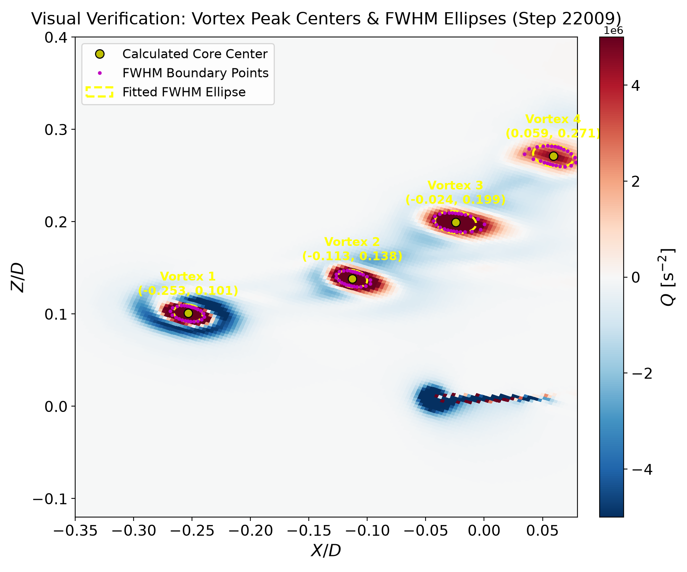
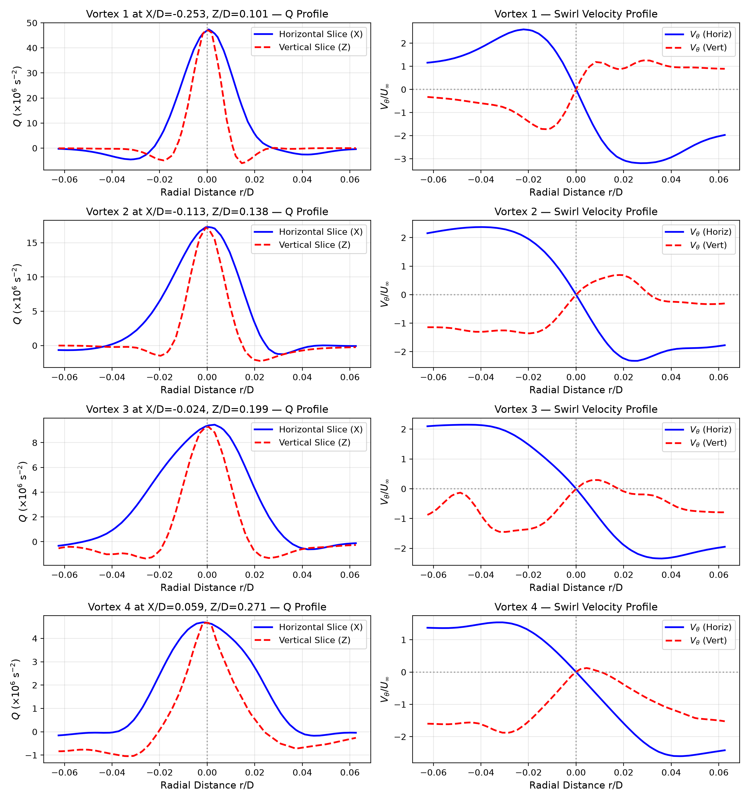
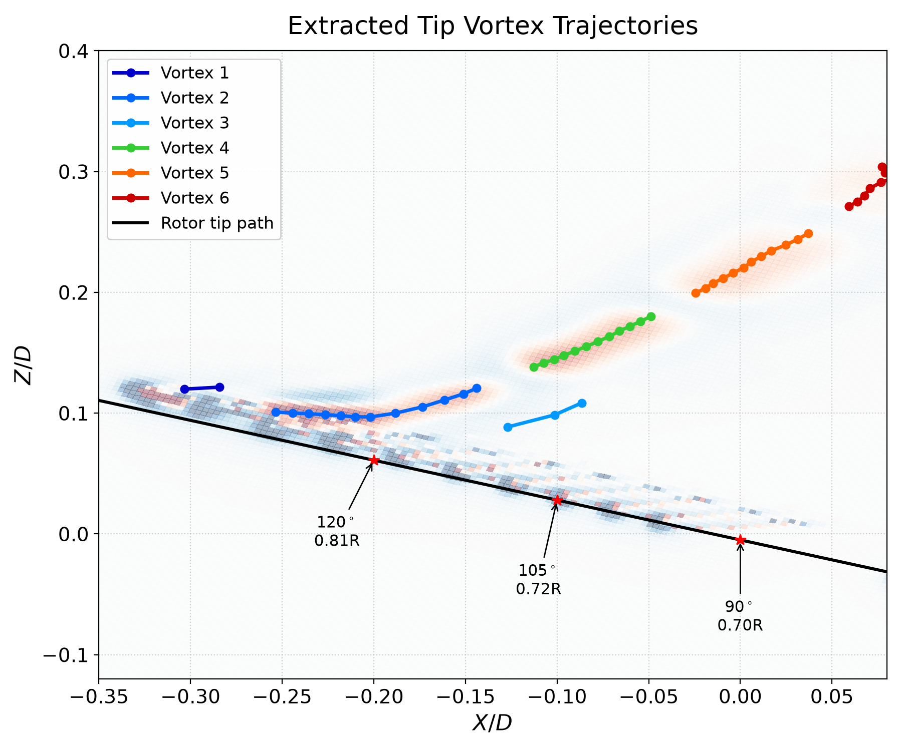
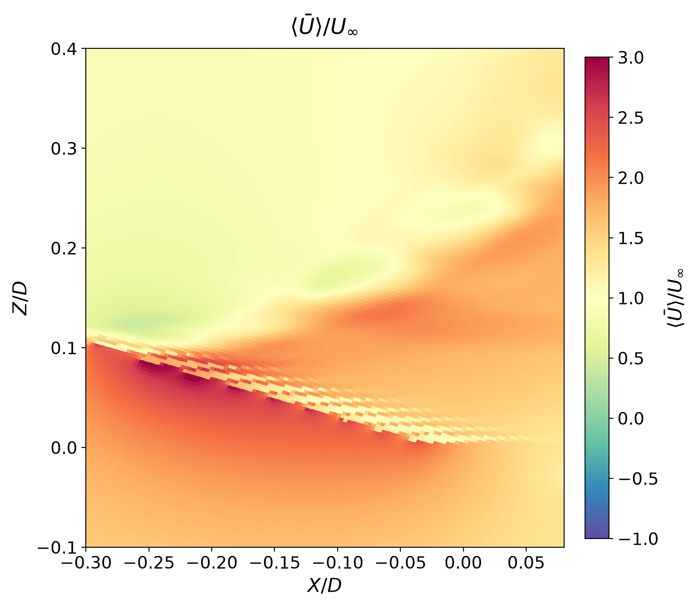
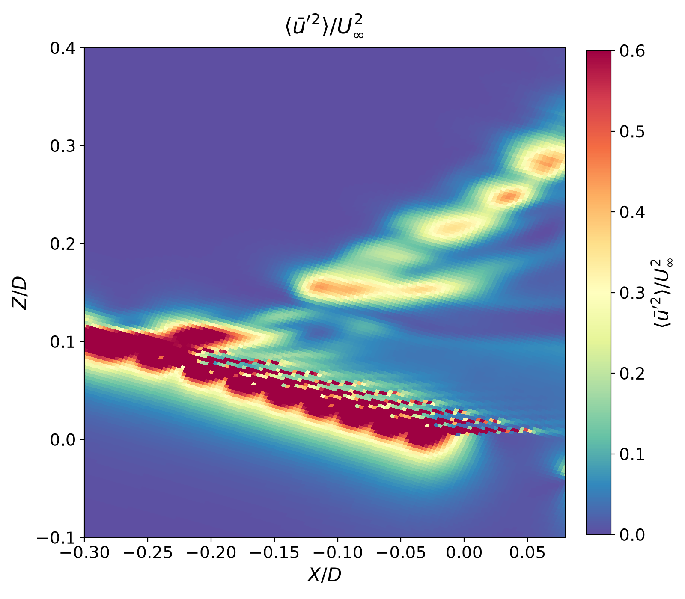
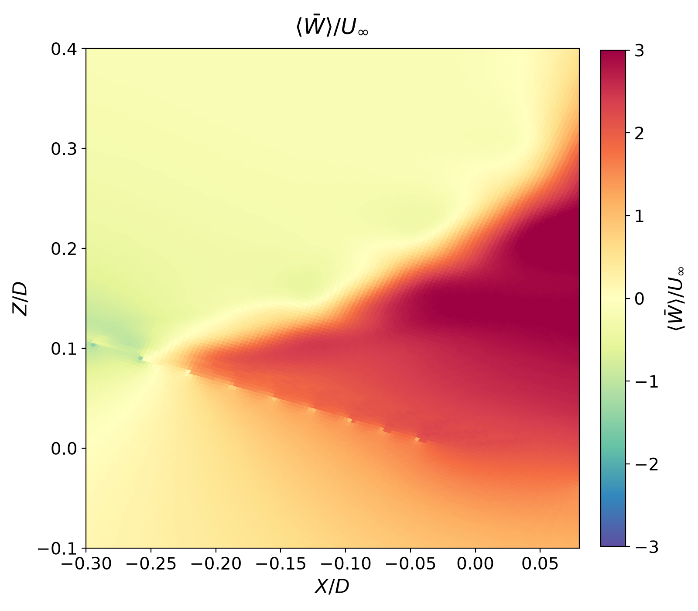
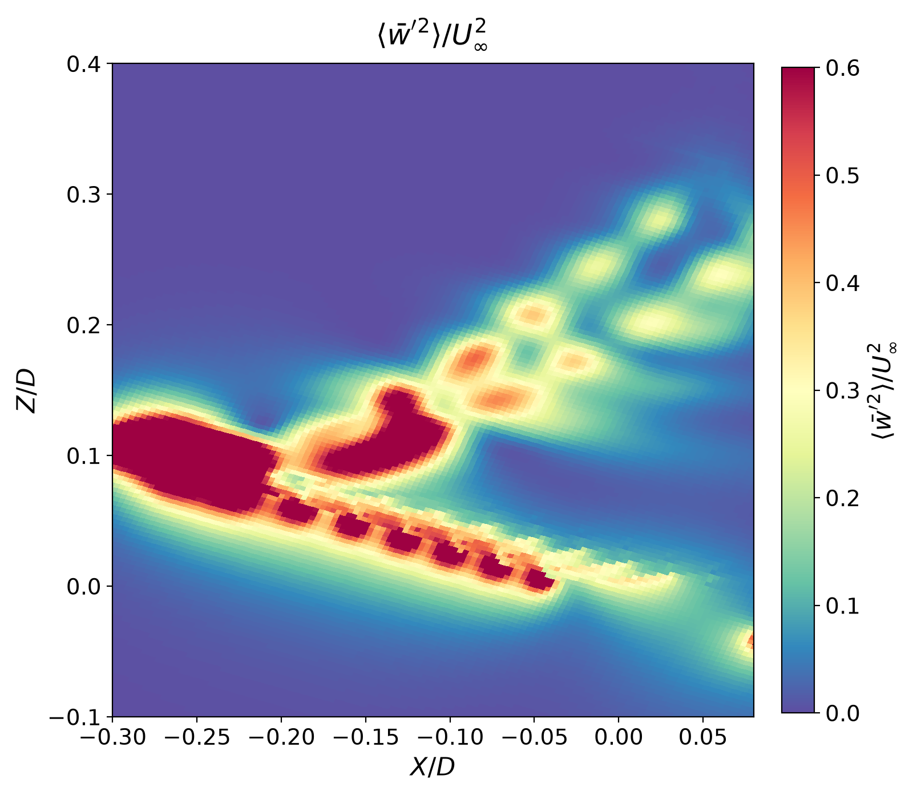

# Rotor Tip Vortex Tracking & Unsteady PIV Analysis Pipeline

An automated, high-fidelity pipeline for processing planar slice data (`.fvuns`), performing Reynolds decomposition ($u' = u - \bar{u}$, $w' = w - \bar{w}$), computing Reynolds normal stresses ($\langle u'^2 \rangle / U_\infty^2$, $\langle w'^2 \rangle / U_\infty^2$), detecting tip vortex cores using $Q$-criterion, fitting 2D core ellipses, tracking vortex trajectories over time, and exporting structured datasets to HDF5 (`velocity_and_vortex_data.h5`) for Python and MATLAB analysis.

---

## Key Features & Methodology

- **Uniform Cartesian Square Grid**:
  - Interpolates unstructured slice data onto a symmetric Cartesian grid bounded by $\pm 0.75 D$ ($\pm 18\text{ in.}$, $461 \times 461$ points, $\Delta x = \Delta z = 0.078125\text{ in.}$).
  - Rotates coordinates and velocity vectors into the rotor/freestream reference frame ($\theta = -20^\circ$).

- **Two-Pass FWHM Boundary Centroid & Ellipse Fitting**:
  - **Pass 1**: Identifies candidate vortex regions and initializes search at the sub-pixel quadratic $Q$-peak. Samples 24 radial spokes to find initial points where $Q(r) = 0.5 Q_{max}$ (Full-Width at Half-Maximum).
  - **Pass 2**: Re-evaluates radial spokes radiating outward from the **centroid of Pass 1**.
  - **Core Center & Ellipse**: The final vortex center $(X/D, Z/D)$ is defined as the exact centroid of these refined FWHM boundary points. The 2-sigma covariance ellipse is centered directly on this centroid, eliminating distortion from nearby blade tip shear layers.

- **1D Radial Slice Verification**:
  - Extracts 1D radial profiles of $Q(r)$ and swirl velocity $V_\theta(r)$ along horizontal and vertical axes through each core center.
  - Empirically verifies zero-crossing of swirl velocity ($V_\theta = 0$) and maximum $Q(r)$ alignment at $r/D = 0$.

- **Continuous Trajectory Tracking & Outlier Rejection**:
  - Tracks individual vortices frame-to-frame with relaxed convective search windows ($\Delta X/D \in [-0.01, 0.08 \Delta t]$, $|\Delta Z/D| \le 0.06 \Delta t$).
  - Applies a 2nd-order polynomial trend distance filter to remove spurious detections, yielding smooth, continuous trajectories.

- **Full HDF5 Data Architecture**:
  - Saves all grid coordinates, time series, time-averaged velocity fields, 3D unsteady fluctuation cubes, Reynolds stresses, and vortex trajectory records with physical units into `velocity_and_vortex_data.h5`.

---

## Visual Verification & Results

### 1. Vortex Core Center Detection & FWHM Ellipse Fitting
Shows the calculated core center (yellow circle), 24 radial spoke FWHM boundary points (magenta dots), and fitted FWHM ellipses (yellow dashed line) for each detected vortex:



---

### 2. 1D Radial Slice Verification ($Q$ & Swirl Velocity $V_\theta$)
Horizontal (blue) and vertical (red dashed) 1D profiles through each detected vortex core, verifying that $Q(r)$ peaks at $r/D = 0$ and swirl velocity $V_\theta(r)$ crosses zero ($V_\theta = 0$) at $r/D = 0$:



---

### 3. Extracted Tip Vortex Trajectories
Trajectories of each individual tip vortex as it convects downstream above the rotor tip path line:



---

### 4. Mean Flow & Reynolds Normal Stresses

| Time-Mean Velocity $\langle \bar{U} \rangle / U_\infty$ | Reynolds Normal Stress $\langle \bar{u}'^2 \rangle / U_\infty^2$ |
| :---: | :---: |
|  |  |

| Time-Mean Velocity $\langle \bar{W} \rangle / U_\infty$ | Reynolds Normal Stress $\langle \bar{w}'^2 \rangle / U_\infty^2$ |
| :---: | :---: |
|  |  |

---

## Repository Structure

```text
.
├── images/                                 # Verification figures displayed in README
├── fvuns_reader_transfer/
│   ├── process_unsteady_and_vortices.py   # Main extraction, decomposition & tracking pipeline
│   ├── plot_comparisons.py                # Standalone figure generation script
│   ├── ellipse_fit.py                     # Moment-based ellipse fitting module
│   ├── fvuns_reader.py                    # Binary parser for .fvuns CFD planar slice files
│   ├── read_h5_example.py                 # Example script to inspect & read HDF5 data
│   ├── process.pbs                        # PBS batch script for cluster execution (NAS)
│   └── average_slices.py                  # Slice phase-averaging utility
├── README.md
└── .gitignore
```

---

## How to Run

### 1. Process Slices and Track Vortices
From the `fvuns_reader_transfer/` directory:
```bash
python process_unsteady_and_vortices.py \
    --input "../coviz/pivplane_*.fvuns" \
    --output_h5 "velocity_and_vortex_data.h5" \
    --dx 0.078125 \
    --dz 0.078125 \
    --theta -20.0 \
    --diameter 24.0 \
    --box_limit_factor 0.75
```

### 2. Generate Standalone Verification Figures
```bash
python plot_comparisons.py \
    --h5 "velocity_and_vortex_data.h5" \
    --outdir "plots"
```

### 3. Cluster Batch Execution (PBS on NAS)
For large cases with hundreds of timesteps:
```bash
qsub process.pbs
```

---

## Reading the HDF5 Output

### In Python
```python
import h5py

with h5py.File("velocity_and_vortex_data.h5", "r") as hf:
    # Grid coordinates (X/D, Z/D)
    X_over_D = hf["grid/X_over_D"][:]
    Z_over_D = hf["grid/Z_over_D"][:]
    
    # Time-averaged velocities and stresses
    U_mean = hf["mean/U_mean_norm"][:]
    u_var  = hf["variance/u_variance_norm"][:]
    
    # 3D instantaneous unsteady velocity cubes: (time, nx, nz)
    u_prime = hf["unsteady/u_prime_norm"][:]
    timesteps = hf["time/timesteps"][:]
    
    # Vortex tracks
    for tr_name in sorted(hf["vortices"].keys()):
        tr = hf[f"vortices/{tr_name}"]
        print(f"{tr_name}: {len(tr['time'])} points, X/D: [{tr['X_over_D'][0]:.3f} -> {tr['X_over_D'][-1]:.3f}]")
```

### In MATLAB
```matlab
% Inspect file structure
h5disp('velocity_and_vortex_data.h5');

% Read normalized coordinates and velocities
X_over_D = h5read('velocity_and_vortex_data.h5', '/grid/X_over_D');
Z_over_D = h5read('velocity_and_vortex_data.h5', '/grid/Z_over_D');
U_mean_norm = h5read('velocity_and_vortex_data.h5', '/mean/U_mean_norm');
u_var_norm  = h5read('velocity_and_vortex_data.h5', '/variance/u_variance_norm');

% Read vortex trajectory
vort1_x = h5read('velocity_and_vortex_data.h5', '/vortices/track_01/X_over_D');
vort1_z = h5read('velocity_and_vortex_data.h5', '/vortices/track_01/Z_over_D');
```
